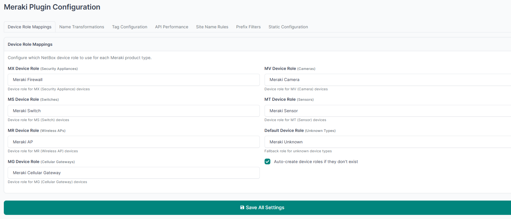
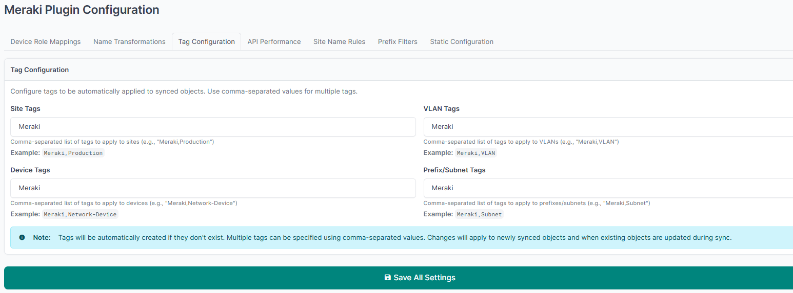
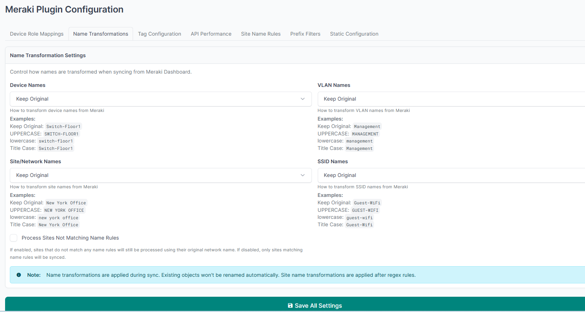
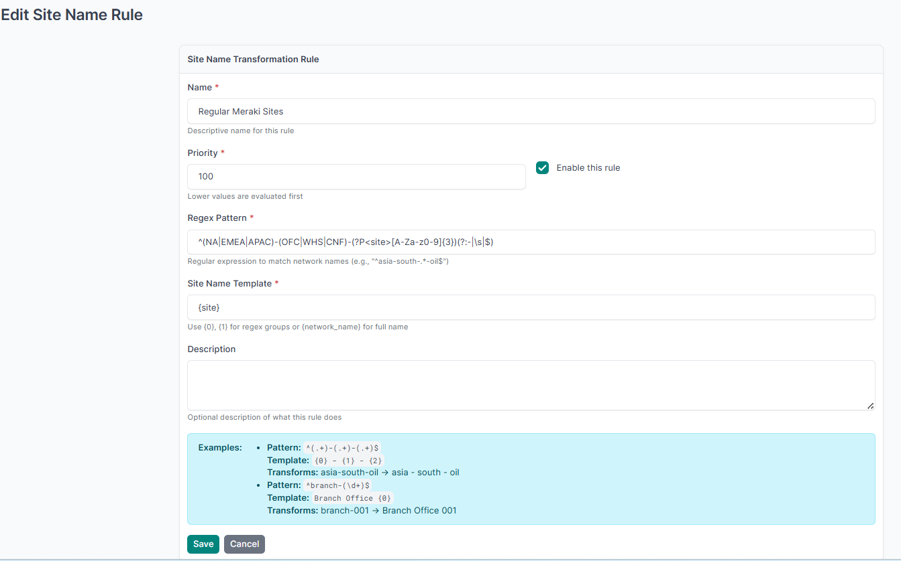
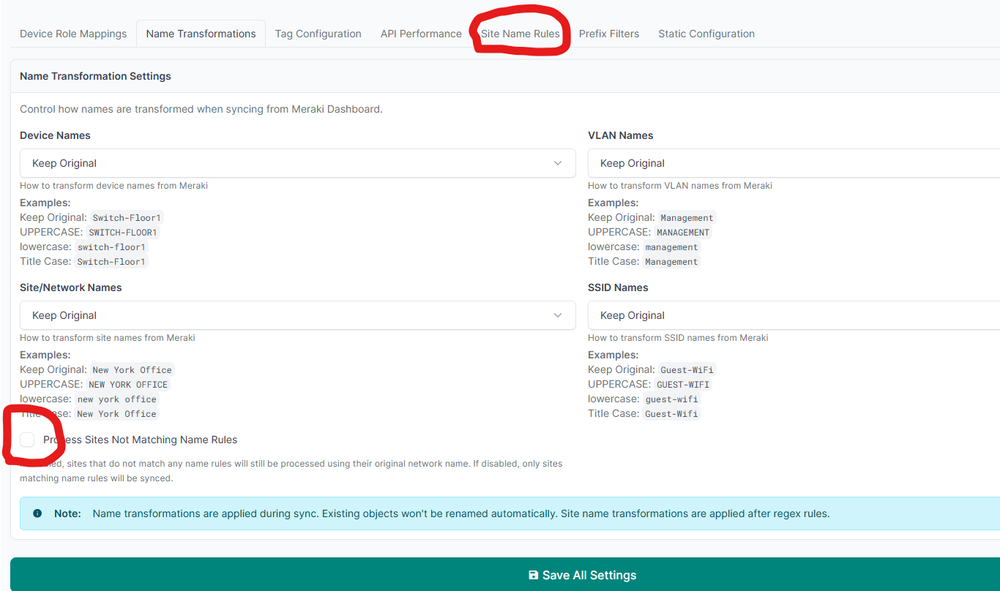

# NetBox Meraki Plugin - Configuration Guide

After installing the plugin, you can access the configuration settings natively within the NetBox UI. Below are the key configuration tabs used to map your Meraki Dashboard objects into NetBox correctly.

## 1. Device Role Mappings
You must configure which NetBox device role maps to each Meraki product type (MX, MS, MR, MG).

## 2. Tag Configuration
Apply specific NetBox tags automatically to all synced Site, Device, Prefix, and VLAN objects.

## 3. Name Transformations & SSIDs
This tab allows you to enforce naming conventions (Uppercase, Title Case, etc.) or just Keep Original.
**Note:** Name transformations are applied during sync. Existing objects won't be renamed automatically to prevent breaking internal links. Also, you can enable **SSID Names** sync from here!

## 4. Site Name Rules (Regex Mapping)
If the name of the Network in Meraki is **not** the same as your Site name in NetBox, and you want to map them successfully, you must create Regex rules!

**Example Configuration:**
* **Regex Pattern:** `^(NA|EMEA|APAC)-(OFC|WHS|CNF)-(?P<site>[A-Za-z0-9]{3})(?:-|\s|$)`
* **Site Name Template:** `{site}`

> **Important Note:** If the regex matches, the network will be added to NetBox. However, any network whose name *doesn't* match a rule will be dropped! In order to add unmatched networks to NetBox anyway, you **must** check the option: **"Process Sites Not Matching Name Rules"**.

